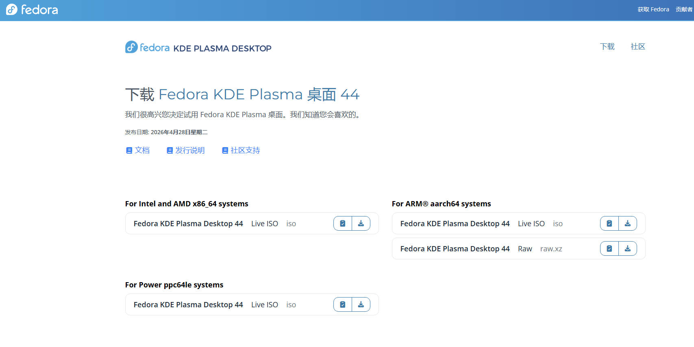
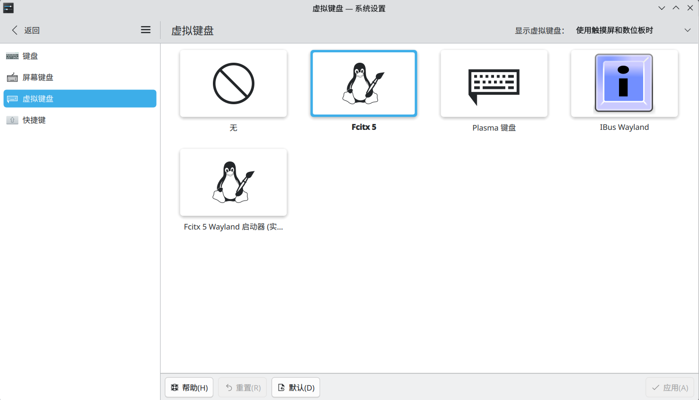
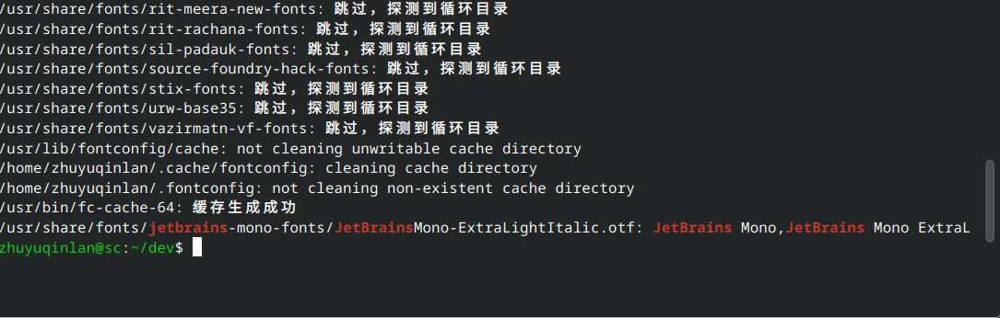

## 前言

去年把主力系统换成 Arch 之后，每次重装都要折腾大半天，pacman 配置、显卡驱动、桌面环境一堆事情。这次换 Fedora 的动机很简单：**想省点时间，但又不想完全失去自定义的自由**。

Fedora KDE Spin 刚好卡在那个平衡点上——滚动更新的包不算太旧，KDE Plasma 开箱即用，RPM Fusion 补上缺失的编解码器之后，日常使用几乎没有障碍。

这篇文章记录从镜像下载到开发环境就绪的全过程，算是一份给自己的快速重装参考。

---

## 系统安装

### 下载镜像

从 Fedora 官方站点下载 KDE Spin 的 ISO：

> https://fedoraproject.org/zh-Hans/kde/download

安装界面比较直观，分区的时候我选择了默认的 Btrfs 布局。选 Btrfs 主要是因为后面要搭 Snapper 快照系统，需要文件系统层面的支持。



安装完成后第一件事是把系统更新到最新：

```bash
sudo dnf update -y
```

---

## 输入法配置

### 安装输入法

Fedora 默认没有中文输入法，装一套 fcitx5 + Rime 即可：

```bash
sudo dnf install fcitx5 fcitx5-rime fcitx5-configtool fcitx5-chinese-addons
```

### KDE 虚拟键盘

KDE 自带屏幕键盘，在系统设置 → 输入设备 → 虚拟键盘里启用即可，触屏设备或者不想用手的时候挺方便。



---

## 启用 RPM Fusion 源

Fedora 官方源出于版权原因缺少很多编解码器和闭源驱动，装完系统第一件事就是加上 RPM Fusion：

```bash
sudo dnf install \
  https://mirrors.rpmfusion.org/free/fedora/rpmfusion-free-release-$(rpm -E %fedora).noarch.rpm \
  https://mirrors.rpmfusion.org/nonfree/fedora/rpmfusion-nonfree-release-$(rpm -E %fedora).noarch.rpm
```

刷新缓存让新源生效：

```bash
sudo dnf clean all
sudo dnf makecache
```

加上之后装 VLC、浏览器解码包之类的就不需要再找第三方仓库了。

---

## 安装 JetBrains Mono Nerd Font

JetBrains Mono 是我在终端和编辑器里的主力字体，Nerd Font 版本额外补上了编程需要的 icons glyphs：

```bash
curl -LO https://github.com/ryanoasis/nerd-fonts/releases/download/v3.5.0/JetBrainsMono.zip
mkdir -p ~/.local/share/fonts
unzip -d ~/.local/share/fonts JetBrainsMono.zip
rm JetBrainsMono.zip
```

刷新字体缓存并确认安装成功：

```bash
fc-cache -fv
fc-list | grep -i "JetBrains"
```



装完之后在终端和编辑器的字体设置里选 `JetBrainsMono Nerd Font` 即可。


---

## 安装常用软件

### VS Code

通过微软官方源安装：

```bash
# 导入 GPG 密钥
sudo rpm --import https://packages.microsoft.com/keys/microsoft.asc

# 添加 VS Code 源
echo -e "[code]\nname=Visual Studio Code\nbaseurl=https://packages.microsoft.com/yumrepos/vscode\nenabled=1\nautorefresh=1\ntype=rpm-md\ngpgcheck=1\ngpgkey=https://packages.microsoft.com/keys/microsoft.asc" | sudo tee /etc/yum.repos.d/vscode.repo > /dev/null

# 更新缓存并安装
sudo dnf check-update
sudo dnf install code
```

### 即时通讯软件

微信、QQ、飞书、腾讯会议通过 Flathub 安装，国内这些软件的 Linux 客户端只有 Flatpak 版本维护得比较勤：

```bash
sudo flatpak remote-add --if-not-exists flathub https://flathub.org/repo/flathub.flatpakrepo
flatpak install com.tencent.WeChat com.qq.QQ cn.feishu.Feishu com.tencent.wemeet
```


### 命令行工具包

一些常用的命令行工具，Fedora 官方源基本都有：

```bash
sudo dnf install vim xeyes proxychains-ng fastfetch vlc ripgrep fd-find libva-utils unrar p7zip yq
```

几个值得说明的：

- **ripgrep (rg)**：比 grep 快很多，递归搜索文件的首选
- **fd-find (fd)**：find 的现代替代品，语法更简洁
- **fastfetch**：neofetch 的轻量替代，系统信息展示更快
- **proxychains-ng**：让不支持代理的命令行工具走代理

---

## Btrfs 快照系统

Btrfs 子卷 + Snapper 自动快照是我这次换发行版的主要原因之一。装完系统 rollback 只需要几秒，不用再怕更新挂掉。

### 安装 Snapper

```bash
sudo dnf install snapper
```

### 创建 root 分区配置

```bash
sudo snapper -c root create-config /
```

这条命令会在根分区上创建 Snapper 配置，之后 `/home` 下的 `.snapshots` 目录就会被自动管理。

验证一下：

```bash
sudo snapper list-configs
```

### 开启自动快照

让 Snapper 在每次 apt/dnf 操作前后和定时任务中自动创建快照：

```bash
sudo systemctl enable --now snapper-timeline.timer
sudo systemctl enable --now snapper-cleanup.timer
```

简单测试一下能不能正常创建快照：

```bash
sudo snapper create -d "测试快照"
```

### 安装 Btrfs Assistant

这是管理 Btrfs 子卷和快照的图形界面工具：

```bash
sudo dnf install btrfs-assistant
```

装完之后在系统设置里就能看到快照管理面板，回滚、删除、对比快照都可以可视化操作。

### 安装 grub-btrfs

让快照直接出现在 GRUB 启动菜单里，系统进不去的时候可以从启动项选择回滚：

```bash
sudo dnf copr enable kylegospo/grub-btrfs
sudo dnf install grub-btrfs
```

更新 GRUB 配置：

```bash
sudo grub2-mkconfig -o /boot/grub2/grub.cfg
```

重启后就能在 GRUB 菜单里看到历史快照了。

---

## 开发工具

### 开发工具包组

Fedora 的 `@development-tools` 包组包含大部分基础开发工具：

```bash
sudo dnf install @development-tools
```

### JDK

我用一个脚本来管理多版本 JDK，从清华大学镜像下载 Adoptium 构建：

```bash
#!/bin/bash
# ========================================
# JDK 安装脚本
# ========================================
JDK_ROOT="$HOME/program/jdk"
mkdir -p "${JDK_ROOT}"

download_and_extract() {
    local tar_file="$1"
    local url="$2"
    local target_dir="$3"

    echo "开始安装: ${tar_file}"
    curl -L --progress-bar -o "${tar_file}" "${url}"
    tar -zxf "${tar_file}" --strip-components=1 -C "${target_dir}"
    rm -f "${tar_file}"
    echo "安装完成: ${target_dir}"
}

# JDK 8 / 11 / 17 / 21 / 25
download_and_extract \
  "jdk-8.tar.gz" \
  "https://mirrors.tuna.tsinghua.edu.cn/Adoptium/8/jdk/x64/linux/OpenJDK8U-jdk_x64_linux_hotspot_8u502b07.tar.gz" \
  "${JDK_ROOT}/jdk8"

download_and_extract \
  "jdk-11.tar.gz" \
  "https://mirrors.tuna.tsinghua.edu.cn/Adoptium/11/jdk/x64/linux/OpenJDK11U-jdk_x64_linux_hotspot_11.0.32_9.tar.gz" \
  "${JDK_ROOT}/jdk11"

download_and_extract \
  "jdk-17.tar.gz" \
  "https://mirrors.tuna.tsinghua.edu.cn/Adoptium/17/jdk/x64/linux/OpenJDK17U-jdk_x64_linux_hotspot_17.0.20_8.tar.gz" \
  "${JDK_ROOT}/jdk17"

download_and_extract \
  "jdk-21.tar.gz" \
  "https://mirrors.tuna.tsinghua.edu.cn/Adoptium/21/jdk/x64/linux/OpenJDK21U-jdk_x64_linux_hotspot_21.0.12_8.tar.gz" \
  "${JDK_ROOT}/jdk21"

download_and_extract \
  "jdk-25.tar.gz" \
  "https://mirrors.tuna.tsinghua.edu.cn/Adoptium/25/jdk/x64/linux/OpenJDK25U-jdk_x64_linux_hotspot_25.0.4_7.tar.gz" \
  "${JDK_ROOT}/jdk25"

echo "JDK 目录："
ls -la "${JDK_ROOT}"
```

日常开发默认用 JDK 17，在 `~/.bashrc` 或 `~/.zshrc` 里配：

```bash
export JAVA_HOME=$HOME/program/jdk/jdk17
export PATH=$JAVA_HOME/bin:$PATH
```

### fnm（Fast Node Manager）

fnm 是 Rust 写的 Node.js 版本管理器，比 nvm 快很多：

```bash
curl -fsSL https://fnm.vercel.app/install | bash
```

### uv 和 Maven

```bash
sudo dnf install uv maven
```

`uv` 是 Rust 写的 Python 包管理器，装依赖的速度比 pip 快一个数量级，已经逐渐替代 pipenv 和 poetry 成为我的首选。

### Rust

```bash
sudo dnf install rustup
rustup-init
```
### go
```bash
curl -L -o go-1.26.5.tar.gz https://go.dev/dl/go1.26.5.linux-amd64.tar.gz
mkdir -p ~/program/go
tar -zxvf go-1.26.5.tar.gz -C ~/program/go
rm go-1.26.5.tar.gz
mv ~/program/go/go ~/program/go/1.26.5
```
#### 设置环境变量
```bash
export PATH=$HOME/program/go/1.26.5/bin:$PATH
```

---

## Dotfiles 与 Zsh

### Dotfiles

我把 shell 配置、git 配置、KDE 设置等统一管理在一个 dotfiles 仓库里，用 GNU Stow 来同步：

> https://github.com/zhuyuqinlan/dotfiles

### 安装 Zsh

```bash
sudo dnf install zsh fzf eza zsh-autosuggestions zsh-syntax-highlighting
```

用 Stow 同步配置：

```bash
cd ~/dotfiles
stow zsh
```

设为默认 shell：

```bash
chsh -s /usr/bin/zsh
echo $SHELL
```

---

## 后记

这次装完大概花了一个下午，主要是 JDK 下载和软件安装比较耗时。Snapper 快照 + Btrfs 的方案目前用下来很稳，几次更新出问题都是几秒钟回滚解决，省了很多排查时间。

后续如果有遇到值得记录的踩坑点，会单独写文章补充。
